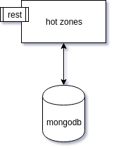

Hot Zones
=========

A service to save hot zones in mongo db and get them and show on map using API



configuration
-------------

[application.properties](src/main/resources/application.properties)

```
spring.application.name=hot_zones
server.port={application port}

#Mongo
spring.data.mongodb.host={mongo address}
spring.data.mongodb.port={mongo port}
spring.data.mongodb.database={mongo db}

```


Installation
------------
1. clone the code
2. gradlew build package `./gradle build`
3. copy application.properties to build/lib
4. configure service with a `application.properties` file in a `config` directory beside jar file  
5. run application with `java -jar <JAR_FILE>.jar`

